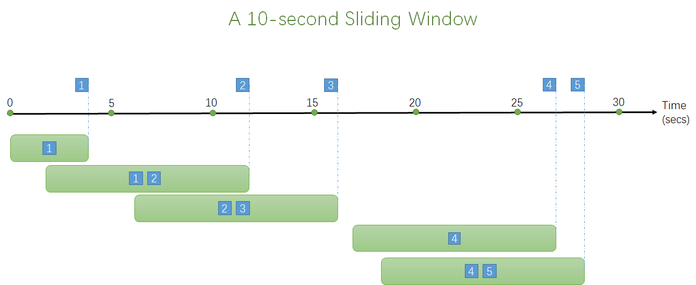

# 窗口

在时间流场景中，对时态窗口中包含的数据执行操作是一种常见的模式。Kuiper对窗口函数提供本机支持，使您能够以最小的工作量编写复杂的流处理作业。

有四种窗口可供使用： [滚动窗口](#TUMBLING WINDOW)， [跳跃窗口](#Hopping window)，[滑动窗口][Sliding window]和 [会话窗口](#Session window)。 您可以在Kuiper查询的查询语法的GROUP BY子句中使用窗口函数。

所有窗口操作都在窗口的末尾输出结果。窗口的输出将是基于所用聚合函数的单个事件。

## 时间单位

窗口中可以使用5个时间单位。 例如，``TUMBLINGWINDOW（ss，10）''，这意味着以10秒为间隔的滚动将数据分组。

DD：天单位

HH ：小时单位

MI：分钟单位

 SS：第二单位

MS ：毫秒单位

## 滚动窗口

滚动窗口函数用于将数据流分割成不同的时间段，并对其执行函数，例如下面的示例。滚动窗口的关键区别在于它们重复不重叠，并且一个事件不能属于多个翻滚窗口。


待办事项: 

- 是否需要时间戳？
- 不支持计数功能。21


```sql
SELECT count(*) FROM demo GROUP BY ID, TUMBLINGWINDOW(ss, 10);
```

## 跳跃窗口

跳跃窗口功能会在时间上向前跳一段固定的时间。 将它们视为可能重叠的翻转窗口可能很容易，因此事件可以属于多个跳跃窗口结果集。 要使“跳跃”窗口与“翻转”窗口相同，请将跳跃大小指定为与窗口大小相同。


待办事项: 

- 是否需要时间戳？
- 不支持计数功能。

```sql
SELECT count(*) FROM demo GROUP BY ID, HOPPINGWINDOW(ss, 10, 5);
```


## 滑动窗口

滑动窗口功能与翻转或跳动窗口不同，仅在事件发生时会产生输出。 每个窗口至少会有一个事件，并且该窗口连续向前移动€（ε）。 就像跳跃窗口一样，事件可以属于多个滑动窗口。



待办事项: 

- 是否需要时间戳？
- 不支持计数功能。

```sql
SELECT count(*) FROM demo GROUP BY ID, SLIDINGWINDOW(mm, 1);
```


## 会话窗口

会话窗口功能对在相似时间到达的事件进行分组，以过滤掉没有数据的时间段。 它有两个主要参数：超时和最大持续时间。


待办事项: 

- 是否需要时间戳？
- 不支持计数功能。


```sql
SELECT count(*) FROM demo GROUP BY ID, SESSIONWINDOW(mm, 2, 1);
```


当第一个事件发生时，会话窗口开始。 如果从上一次摄取的事件起在指定的超时时间内发生了另一个事件，则窗口将扩展为包括新事件。 否则，如果在超时时间内未发生任何事件，则该窗口将在超时时关闭。

如果事件在指定的超时时间内持续发生，则会话窗口将继续扩展直到达到最大持续时间。 最大持续时间检查间隔设置为与指定的最大持续时间相同的大小。 例如，如果最大持续时间为10，则检查窗口是否超过最大持续时间将在t = 0、10、20、30等处进行。